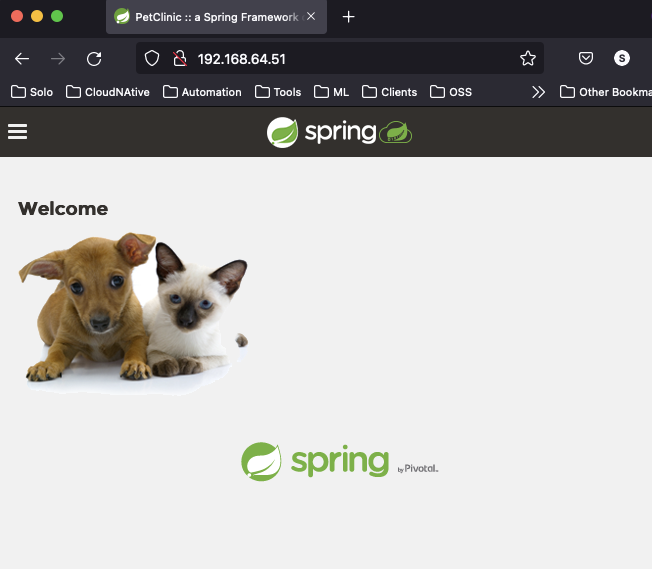

# Fluxcd and Gloo Edge

This repo was cloned from the [Fluxcd Project](https://github.com/fluxcd/flux2-kustomize-helm-example)

## Prerequisites

Request a Gloo Edge Enterprise [trial license](https://lp.solo.io/request-trial).

You will need a Kubernetes cluster version 1.16 or newer and kubectl version 1.18.
For a quick local test, you can use [Microk8s](https://www.solo.io/blog/a-local-development-kubernetes-environment-for-gloo-edge/).
Any other Kubernetes should work, in general the cluster needs to support Kubernetes ServiceType Loadbalancer and connectivity to those IPs.

In order to follow the guide you'll need a GitHub account and a
[personal access token](https://help.github.com/en/github/authenticating-to-github/creating-a-personal-access-token-for-the-command-line)
that can create repositories (check all permissions under `repo`).

Install the Flux CLI on MacOS and Linux using Homebrew:

```sh
brew install fluxcd/tap/flux
```

Or install the CLI by downloading precompiled binaries using a Bash script:

```sh
curl -s https://fluxcd.io/install.sh | sudo bash
```

## Repository structure

The Git repository contains the following top directories:

- **apps** dir contains kubernetes application manifests, which are then customized per cluster.
- **infrastructure** dir contains common infrastructure services such as datastores, ingress controllers, etc. and Helm repository definitions. In this case [Gloo Edge Enterprise](https://docs.solo.io/gloo-edge/latest/) 
- **clusters** dir contains the Flux configuration per cluster

```
├── apps
│   ├── base
│   └── staging
├── infrastructure
│   ├── glooedge
│   ├── keycloak
│   └── sources
└── clusters
    └── staging
```

The apps configuration is structured into:

- **apps/base/** dir contains namespaces and kubernetes manifest or Helm release definitions
- **apps/staging/** dir contains the staging values

```
├── apps
│   ├── base
│   │   └── petclinic
│   │       ├── kustomization.yaml
│   │       ├── namespace.yaml
│   │       ├── service-app.yaml
│   │       ├── service-db.yaml
│   │       ├── statefulset-app.yaml
│   │       ├── statefulset-db.yaml
│   │       └── virtualservice.yaml
│   └── staging
│       ├── kustomization.yaml
│       ├── petclinic
│       │   ├── authconfig.yaml
│       │   └── kustomization.yaml
│       └── ratelimit.yaml
```

In **apps/base/petclinic/** dir we have a manifests with common values for both clusters:

```yaml
apiVersion: gateway.solo.io/v1
kind: VirtualService
metadata:
  name: petclinic
  namespace: gloo-system
spec:
  virtualHost:
    domains:
      - '*'
    routes:
      - matchers:
         - prefix: /
        routeAction:
          single:
            upstream:
              name: default-petclinic-80
              namespace: gloo-system
```

In **apps/staging/** dir we have a Kustomize patch with the staging specific values:

```yaml
apiVersion: enterprise.gloo.solo.io/v1
kind: AuthConfig
metadata:
  name: oauth
  namespace: gloo-system
spec:
  configs:
  - oauth2:
      oidcAuthorizationCode:
        appUrl: https://192.168.64.51
        callbackPath: /callback
        clientId: 2504c599-fcab-4174-9164-a77d3fb5db14 
        clientSecretRef:
          name: oauth
          namespace: gloo-system
        issuerUrl: "http://192.168.64.50:8080/auth/realms/master/"
        scopes:
        - email
        headers:
          idTokenHeader: jwt
```

Note: For each environment or cluster you may change the OIDC configuration.

Infrastructure:

```
./infrastructure/
│   ├── glooedge
│   │   ├── kustomization.yaml
│   │   ├── namespace.yaml
│   │   └── release.yaml
│   ├── keycloak
│   │   ├── deployment.yaml
│   │   ├── keycloak.yaml
│   │   ├── kustomization.yaml
│   │   ├── namespace.yaml
│   │   └── service.yaml
│   ├── kustomization.yaml
│   └── sources
│       ├── glooedge.yaml
│       └── kustomization.yaml
```

In **infrastructure/sources/** dir we have the Gloo Edge Enterprise Helm repositories definitions:

```yaml
apiVersion: source.toolkit.fluxcd.io/v1beta1
kind: HelmRepository
metadata:
  name: glooedge-e 
spec:
  interval: 30m
  url: https://storage.googleapis.com/gloo-ee-helm
```

Note that with ` interval: 30m` we configure Flux to pull the Helm repository index every 30 minutes.

## Bootstrap staging environment (cluster)

The clusters dir contains the Flux configuration:

```
./clusters/
└── staging
    ├── apps.yaml
    └── infrastructure.yaml
```

In **clusters/staging/** dir we have the Kustomization definitions:

```yaml
apiVersion: kustomize.toolkit.fluxcd.io/v1beta1
kind: Kustomization
metadata:
  name: apps
  namespace: flux-system
spec:
  interval: 10m0s
  dependsOn:
    - name: infrastructure
  sourceRef:
    kind: GitRepository
    name: flux-system
  path: ./apps/staging
  prune: true
  validation: client
  timeout: 2m
---
kind: Kustomization
metadata:
  name: infrastructure
  namespace: flux-system
spec:
  interval: 10m0s
  sourceRef:
    kind: GitRepository
    name: flux-system
  path: ./infrastructure
  prune: true
  validation: client
  healthChecks:
    - apiVersion: apps/v1
      kind: Deployment
      name: gloo
      namespace: gloo-system
  timeout: 10m
```

Note that with `path: ./apps/staging` we configure Flux to sync the staging Kustomize overlay and 
with `dependsOn` we tell Flux to create the infrastructure items before deploying the apps.

Fork this repository on your personal GitHub account and export your GitHub access token, username and repo name:

```sh
export GITHUB_TOKEN=<your-token>
export GITHUB_USER=<your-username>
export GITHUB_REPO=<repository-name>
```

Verify that your staging cluster satisfies the prerequisites with:

```sh
flux check --pre
```

Update infrastructure/glooedge/release.yaml license_key with your trial license:

```yaml
  install:
    remediation:
      retries: 5 
  values:
    license_key: "eyJl.........."
    gloo:
      gloo:
        deployment:
          image:
            tag: 1.8.6
```

Set the kubectl context to your staging cluster (in this case it's a local microk8s) and bootstrap Flux:

```sh
flux bootstrap github \
    --context=microk8s \
    --owner=${GITHUB_USER} \
    --repository=${GITHUB_REPO} \
    --token-auth \
    --branch=main \
    --personal \
    --path=clusters/staging
```

The bootstrap command commits the manifests for the Flux components in `clusters/staging/flux-system` dir
and creates a deploy key with read-only access on GitHub, so it can pull changes inside the cluster.

Wait for the Gloo Edge, Keycloak and Petclinic application installations to complete on staging:

```console
kubectl get po -n flux-system
NAME                                       READY   STATUS    RESTARTS   AGE
helm-controller-7b58d45956-c6dl9           1/1     Running   0          18m
notification-controller-5f4f4967b9-9v5pw   1/1     Running   0          18m
kustomize-controller-bb6c99658-8pf9k       1/1     Running   0          18m
source-controller-6448c7989-wwgn6          1/1     Running   0          18m

kubectl get po -n gloo-system
NAME                                                  READY   STATUS    RESTARTS   AGE
redis-d7786cb9d-tqtbp                                 1/1     Running   0          8m23s
gloo-58cf777ffb-n86qp                                 1/1     Running   0          8m23s
gateway-proxy-659c5cdc96-8rvl8                        1/1     Running   0          8m22s
discovery-89cc57dbd-rqp6k                             1/1     Running   0          8m23s
observability-6894c76ddb-qgtwg                        1/1     Running   0          8m22s
gloo-fed-7b9ff9c44-m7x46                              1/1     Running   0          8m22s
glooe-prometheus-kube-state-metrics-85c5fcb4c-xp7qb   1/1     Running   0          8m23s
gateway-7dbd774b84-xjdrk                              1/1     Running   0          8m23s
glooe-grafana-75dfc55d4d-tgtrb                        1/1     Running   0          8m23s
extauth-6489bc55f9-6mldc                              1/1     Running   0          8m22s
gloo-fed-console-65859578c7-wqtxz                     3/3     Running   0          8m22s
glooe-prometheus-server-d99d4477b-8vcr9               2/2     Running   0          8m22s
rate-limit-5dfb7b4cbb-b47cm                           1/1     Running   1          8m22s

kubectl get po -n default
NAME                       READY   STATUS    RESTARTS   AGE
keycloak-d68dbc7fb-psn99   1/1     Running   0          16m
petclinic-0                1/1     Running   0          12m
petclinic-db-0             1/1     Running   0          12m

```

Verify Gloo Edge proxy service EXTERNAL-IP can be accessed, in this case 192.168.64.51:

```console
kubectl -n gloo-system get service/gateway-proxy
NAME            TYPE           CLUSTER-IP      EXTERNAL-IP     PORT(S)                      AGE
gateway-proxy   LoadBalancer   10.152.183.20   192.168.64.51   80:31344/TCP,443:32573/TCP   11m
```

Clone your personal forked repo locally and cd into the folder. We will now finalise the configuration and start to add TLS encryption, Authentication, Rate Limiting and Transformation capabilties to the Petclinic application via Git commits.

First finalise Keycloak (OIDC) configurtaion by running ./scripts/setup.sh
We'll use the APP_URL, KEYCLOAK_URL & client outputs to configure the AuthConfig later.

```console
./scripts/setup.sh
Generating a 2048 bit RSA private key
...............+++
..........+++
writing new private key to 'tls.key'
-----
secret/upstream-tls created
TLS certificate secret created
### Petclinic URL for AuthConfig ###
APP_URL: https://192.168.64.51
### Keycloak endpoint for AuthConfig ###
KEYCLOAK_URL: http://192.168.64.50:8080/auth
  % Total    % Received % Xferd  Average Speed   Time    Time     Time  Current
                                 Dload  Upload   Total   Spent    Left  Speed
100  1803  100  1734  100    69   3000    119 --:--:-- --:--:-- --:--:--  3119
  % Total    % Received % Xferd  Average Speed   Time    Time     Time  Current
                                 Dload  Upload   Total   Spent    Left  Speed
100   571  100   542  100    29   4839    258 --:--:-- --:--:-- --:--:--  5053
### Keycloak Client ID for AuthConfig ###
client: 5b6b138b-1e1d-44ea-82e2-081f1d4de695
  % Total    % Received % Xferd  Average Speed   Time    Time     Time  Current
                                 Dload  Upload   Total   Spent    Left  Speed
100  1371  100  1317  100    54  23105    947 --:--:-- --:--:-- --:--:-- 24052
Keycloak users created
+--------+-------+
| SECRET | TYPE  |
+--------+-------+
| oauth  | OAuth |
+--------+-------+
Keycloak configuration complete
```
## Add API Gateway security features to the application
At this stage you should be able to open the Petclinic application in your browser, http://192.168.64.51 in this case.


- **Add TLS Encryption**
The setup script created the required certificate and kubernetes secret.
We edit apps/base/petclinic/virtualservice.yaml and remove the comments for the SSL Config section
```console
spec:
# ---------------- SSL config ---------------------------
  sslConfig:
    secretRef:
      name: upstream-tls
      namespace: gloo-system
# -------------------------------------------------------
  virtualHost:
```
Note: Leave the rest of the file as is.

Now all we need to do is commit the change to Github and wait for Fluxcd to reconsile the change.

```sh
git add -A && git commit -m "staging update" && git push
```

You will now have to use HTTPS (https://192.168.64.51/) to access Petclinic. It's a self signed certificate, so accept the certificate warnings in your browser.


- **Add Authentication**
The setup script configured Keycloak with users, but we need to update apps/staging/petclinic/authconfig.yaml for your environment. Then we'll update apps/staging/petclinic/kustomization.yaml to apply the configuration.

